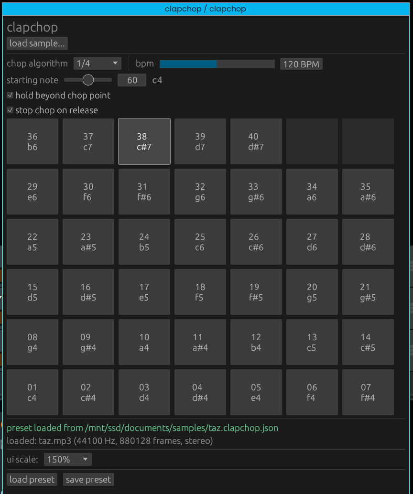

# clapchop

ergonomic sample chopping in a [CLAP plugin](https://cleveraudio.org/)



## usage

1. load a sample with the "Browse..." button.
2. choose a slice algorithm / BPM to set chop points.
3. hit the buttons to make the sounds

## options

- "Hold beyond slice"
  - continuing to hold the trigger button will continue playing sample past the chop point.
- "Gate on release"
  - depressing the trigger button will stop sample playback before the chop endpoint.

these options are both _enabled_ by default.

## development

```bash
cargo run --package xtask -- bundle clapchop --release
```

- The bundler produces a `.clap` bundle at `target/bundled/clapchop.clap`.
- Copy or symlink the bundled plugin (`clapchop.clap`) to your CLAP plug-ins folder (e.g., `~/.clap/`).

### license

MIT
